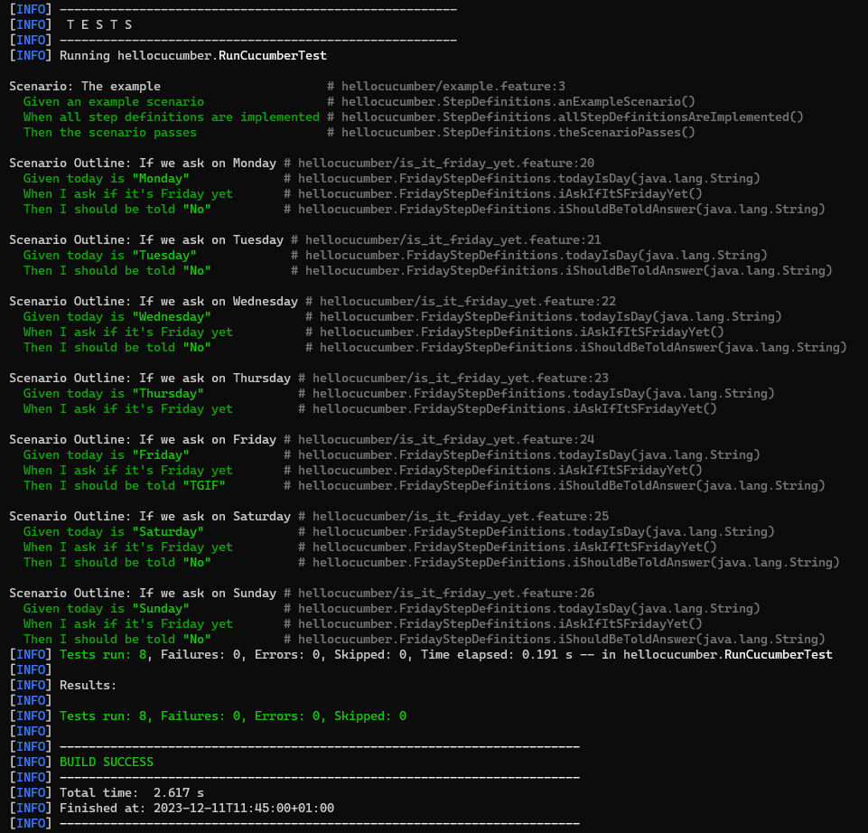

= R5.A.08 -- Dépôt pour les TPs
:icons: font
:MoSCoW: https://fr.wikipedia.org/wiki/M%C3%A9thode_MoSCoW[MoSCoW]
:toc:

image:https://classroom.github.com/assets/open-in-vscode-718a45dd9cf7e7f842a935f5ebbe5719a5e09af4491e668f4dbf3b35d5cca122.svg[link="https://classroom.github.com/online_ide?assignment_repo_id=13208641&assignment_repo_type=AssignmentRepo"]

Ce dépôt concerne les rendus de mailto:zakaria.belkheiri@etu.univ-tlse2.fr[Zakaria BELKHEIRI].

== TP1

.Contenu du fichier :  icon:file[] `is_it_friday_yet.feature`
[source, gherkin]
----
Feature: Is it friday yet?

  Scenario Outline: If we ask on <day>
    Given today is "<day>"
    When I ask if it's Friday yet
    Then I should be told "<answer>"

    Examples:
      | day       | answer |
      | Monday    | No     |
      | Tuesday   | No     |
      | Wednesday | No     |
      | Thursday  | No     |
      | Friday    | TGIF   |
      | Saturday  | No     |
      | Sunday    | No     |
----

.Capture d'écran de l'exécution des tests

== TP2
